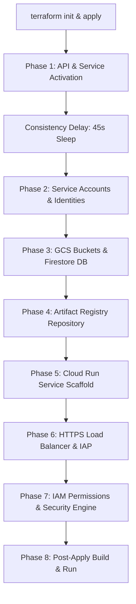

# 🛠️ Terraform Deployment & Execution Deep-Dive

This document provides a highly detailed, step-by-step explanation of what happens under the hood when you deploy **GenMedia Creative Studio** using Terraform. It traces the lifecycle of every created resource, explains regional variables, maps highly specific IAM permissions, and describes the subsequent build and deployment pipeline.

---

## 🗺️ Architectural Overview

When you deploy Creative Studio via Terraform, it provisions a **secure, zero-trust, serverless architecture** backed by Google Cloud's enterprise security layers (IAP, Serverless NEGs, and GCLB). 

The entire process is organized into a chronological sequence of stages:



---

## 🏗️ Phase-by-Phase Execution Sequence

### Phase 0: Local Initialization (`terraform init` & `plan`)
When you execute `terraform init`, Terraform's engine analyzes the `terraform` block in `main.tf` and:
1. **Downloads Providers:** Resolves and downloads the specific versions of the **Google** and **Google-Beta** providers (pinned to `~> 6.49`). These are stored in the local `.terraform/` directory.
2. **Lock File Generation:** Creates or updates `.terraform.lock.hcl` to ensure cryptographically secure, repeatable runs.

When you execute `terraform apply`, Terraform builds a **Directed Acyclic Graph (DAG)** of all resources, determines dependencies, and prompts for confirmation.

---

### Phase 1: API & Service Activation (`module "project-services"`)
The very first action Google Cloud takes is enabling the core APIs required for the application. If any resources are provisioned before these APIs are active, GCP will return `403 Forbidden` or `404 Not Found` errors.

Terraform activates the following **12 APIs** in parallel:

| API Service Identifier | Purpose in Creative Studio |
| :--- | :--- |
| **`iap.googleapis.com`** | Enables Identity-Aware Proxy to secure the app without managing an auth provider. |
| **`compute.googleapis.com`** | Provisions Compute Engine infrastructure required for Load Balancing and NEGs. |
| **`certificatemanager.googleapis.com`** | Generates and manages the free, Google-managed SSL certificate for custom domains. |
| **`cloudbuild.googleapis.com`** | Compiles, builds, and publishes your application's container image. |
| **`run.googleapis.com`** | Hosts the containerized Python/Mesop web app serverlessly. |
| **`artifactregistry.googleapis.com`** | Hosts the private Docker registry for storing built application images. |
| **`containerscanning.googleapis.com`** | Performs security vulnerability scans on pushed Docker images. |
| **`storage.googleapis.com`** | Handles all media assets, generated content, and source code uploads. |
| **`aiplatform.googleapis.com`** | Vertex AI platform—powers Veo, Lyria, Chirp 3, Imagen, and Gemini models. |
| **`firestore.googleapis.com`** | Powers the native Firestore metadata index for user history and asset libraries. |
| **`serviceusage.googleapis.com`** | Validates quotes, services, and handles API request enablement. |
| **`cloudresourcemanager.googleapis.com`** | Modifies IAM policies and adds project-level role bindings securely. |

> [!IMPORTANT]
> **The Eventual Consistency Delay (`null_resource.sleep`)**  
> Google Cloud's API activation is eventually consistent across global regional databases. To prevent race conditions where resources are created before an API is fully operational, Terraform runs a **`sleep` command for 45 seconds** (`var.sleep_time`) immediately after enabling services.

---

### Phase 2: Service Accounts & Identities Setup
To maintain a high-security posture, two unique **custom Service Accounts** are provisioned along with standard service identity principals:

1. **Application Service Account (`google_service_account.creative_studio`):**
   - **Identity:** `service-creative-studio@<PROJECT_ID>.iam.gserviceaccount.com`
   - **Purpose:** Serves as the runtime identity for the Cloud Run container. The container runs *under* this identity, meaning it is restricted strictly to the minimum set of permissions necessary to function (e.g. read/write to Firestore, make Vertex AI calls).
2. **Cloud Build Service Account (`google_service_account.cloudbuild`):**
   - **Identity:** `builds-creative-studio@<PROJECT_ID>.iam.gserviceaccount.com`
   - **Purpose:** Executes the compilation and deployment process. It has permissions to read code from storage, build the container, push it to Artifact Registry, and deploy updates to Cloud Run.
3. **IAP Service Identity (`google_project_service_identity.iap_sa`):**
   - Pre-creates and claims the system service identity for IAP so it can invoke Cloud Run services.
4. **Vertex Service Identity (`google_project_service_identity.vertex_sa`):**
   - Ensures the Vertex AI system identity is fully provisioned to communicate and process media workloads.

---

### Phase 3: Database & Component Provisioning

#### 1. Firestore Database (`google_firestore_database.create_studio_asset_metadata`)
Terraform boots a native Firestore instance with the following specifications:
- **Database ID:** `create-studio-asset-metadata`
- **Location:** Set to your deployment `var.region` (e.g. `us-central1`).
- **Type:** `FIRESTORE_NATIVE`
- **Concurrency Mode:** `OPTIMISTIC` (highly scalable, parallel-friendly transactional lock management).
- **Point-in-Time Recovery (PITR):** Enabled for disaster recovery and snapshot rollbacks.
- **Delete Protection:** Automatically aligned with `var.enable_data_deletion` (default to active `DELETE_PROTECTION_ENABLED` for safety).

#### 2. Composite Database Indexes (`google_firestore_index`)
To prevent Firestore queries from failing when users browse their libraries, Terraform creates **4 custom composite indexes** on the `genmedia` collection:

*   `mime_type` (ASC) + `timestamp` (DESC): For quick filtering by asset type (e.g., viewing only videos) ordered by recency.
*   `media_type` (ASC) + `timestamp` (DESC): For categorizing assets (image/video/audio) by date.
*   `user_email` (ASC) + `timestamp` (DESC): For displaying a personalized gallery showing only the logged-in user's historic generations.
*   `user_email` (ASC) + `mime_type` (ASC) + `timestamp` (DESC): For filtering a user's private gallery by specific media types.

#### 3. Storage Buckets (`google_storage_bucket` & `module.source_bucket`)
- **Assets GCS Bucket (`creative-studio-<PROJECT_ID>-assets`):**
  - **Purpose:** Stores generated images, audio, video outputs, and user-provided inputs (e.g. for Virtual Try-On).
  - **Public Access Prevention:** Enforced (`enforced`). All objects are private.
  - **CORS Config:** Strictly limited to the deployed website URL (whether custom domain or Cloud Run domain) and local hostports (`localhost:8080` / `0.0.0.0:8080`) if local domain CORS requests are enabled in configuration.
- **Source Code Staging Bucket (`run-resources-<PROJECT_ID>-<REGION>`):**
  - **Purpose:** Used as a staging area by Cloud Build to upload the repository source code and assets before compiling the container image.

---

### Phase 4: Artifact Registry Repository (`google_artifact_registry_repository.creative_studio`)
Terraform creates a secure, private Docker registry:
- **Repository ID:** `creative-studio`
- **Format:** `DOCKER`
- **Region:** `var.region`
- **Vulnerability Scanning:** Inherits project configuration to automatically scan pushed images for CVEs.

---

### Phase 5: Cloud Run Service Scaffold (`google_cloud_run_v2_service.creative_studio`)
Terraform provisions the container scaffold which will host the Mesop web application:
- **Service Name:** `creative-studio`
- **Ingress Control:**
  - If using Load Balancer (`var.use_lb = true`): Configured to `INGRESS_TRAFFIC_INTERNAL_LOAD_BALANCER`. This blocks all direct internet access to the Cloud Run URL, forcing traffic through the secure Load Balancer.
  - If not using Load Balancer (`var.use_lb = false`): Configured to `INGRESS_TRAFFIC_ALL`.
- **Scaling Safeguards:** Pinned to `max_instance_count = 1` by default to avoid unintended costs.
- **Resource Allocations:** 1.0 CPU (`1000m`) and 1GB RAM (`1024Mi`).
- **Initial Image:** `us-docker.pkg.dev/cloudrun/container/placeholder`. This is a tiny placeholder container because the actual code has not been built or compiled yet.
- **Environment Variables:** Injects 13 production environment variables:
  - `PROJECT_ID` / `LOCATION`: Configured to your active project and region.
  - `GENMEDIA_BUCKET` / `VIDEO_BUCKET` / `MEDIA_BUCKET` / `IMAGE_BUCKET` / `GCS_ASSETS_BUCKET`: Points strictly to the provisioned private assets bucket.
  - `GENMEDIA_FIREBASE_DB`: Configured to `create-studio-asset-metadata` (tells Python to connect to our custom database).
  - `SERVICE_ACCOUNT_EMAIL`: Passes the custom runtime SA email.
  - Generative model pointers (`MODEL_ID`, `VEO_MODEL_ID`, `VEO_EXP_MODEL_ID`, `LYRIA_MODEL_VERSION`, `GEMINI_CRITIQUE_MODEL_ID`, etc.).

> [!TIP]
> **The Critical Lifecycle Guard (`ignore_changes`)**  
> Inside the Cloud Run service declaration, Terraform includes `lifecycle { ignore_changes = [template[0].containers[0].image] }`. This is an essential DevOps pattern! It means that when you deploy subsequent code updates using `build.sh`, Terraform **ignores** that the container image has changed from the placeholder to your actual application container. The next time you run `terraform apply`, it won't attempt to revert your live application back to the placeholder container!

---

### Phase 6: HTTPS Load Balancer & Identity-Aware Proxy (Optional)
If `var.use_lb` is set to `true`:
1. **Serverless NEG (`google_compute_region_network_endpoint_group.cloudrun_neg`):** Prepares a network endpoint group that routes incoming internet requests directly to the serverless Cloud Run instance.
2. **HTTP Load Balancer (`module.lb-http`):** Creates an external, globally distributed Load Balancer (`EXTERNAL_MANAGED`) that handles HTTPS termination and automatic HTTP-to-HTTPS redirects.
3. **Google-Managed SSL Certificate:** Generates a free SSL certificate for the domain specified in `var.domain`.
4. **IAP Configuration:** Enforces **Identity-Aware Proxy (IAP)** on the load balancer backend. All anonymous internet users are blocked at the Google edge network. Only users with valid Google accounts explicitly authorized inside your project can pass through to the application backend.

---

## 🔒 The IAM & Permission Engine (Who Gets What?)

To secure access between services, Terraform configures highly targeted IAM roles. Here is the exact list of permission additions and changes that take place during `terraform apply`:

### 1. Runtime Permissions (Application Service Account)
These allow the running Mesop application to work with GCP services without needing hardcoded credentials or API keys:

*   **`roles/storage.objectCreator`** (Assets GCS Bucket):  
    *Allows the web app to save new generated images, videos, and music files.*
*   **`roles/storage.objectViewer`** (Assets GCS Bucket):  
    *Allows the web app to read previously generated assets from the bucket.*
*   **`roles/storage.bucketViewer`** (Assets GCS Bucket):  
    *Allows checking bucket metadata and file lists.*
*   **`roles/storage.objectUser`** (Assets GCS Bucket):  
    *Full access to read/write/delete objects and generate download URLs.*
*   **`roles/iam.serviceAccountTokenCreator`** (Project Level):  
    > [!IMPORTANT]
    > **Signed URL Generation Security**  
    > Since the GCS asset bucket is completely private, users cannot view images directly via standard URLs. Instead, the application dynamically generates **signed, temporary read URLs** that last for a few minutes. To do this, the application service account needs the `roles/iam.serviceAccountTokenCreator` role, allowing it to sign secure, short-lived URLs on behalf of Google Cloud.
*   **`roles/datastore.user`** (Firestore DB Context):  
    *Grants database reading and writing permissions.*
    > [!TIP]
    > **Conditional IAM Micro-segmentation**  
    > Instead of granting database access project-wide, Terraform uses an IAM **Condition Expression**:  
    > `resource.name == "projects/<PROJECT_ID>/databases/create-studio-asset-metadata"`.  
    > This guarantees that even if a security breach occurs inside the web container, it **cannot** read or write to any other database in your GCP account!
*   **`roles/aiplatform.user`** (Project Level):  
    *Allows the application to make model prediction calls (Gemini, Veo, Chirp, Lyria) through the Vertex AI API.*

---

### 2. Compilation & Deployment Permissions (Cloud Build Service Account)
These allow Cloud Build to safely assemble, test, and release the application container:

*   **`roles/iam.serviceAccountUser`** (Application SA Context):  
    *Allows the Cloud Build service account to "impersonate" or deploy using the `service-creative-studio` identity.*
*   **`roles/logging.logWriter`** (Project Level):  
    *Allows Cloud Build to output standard stdout/stderr logs directly into Cloud Logging for developer inspection.*
*   **`roles/artifactregistry.reader` / `roles/artifactregistry.writer`** (Artifact Registry Context):  
    *Allows pulling base images and pushing the compiled Docker container directly into the private registry repository.*
*   **`roles/run.developer`** (Cloud Run Service Context):  
    *Grants the authority to deploy and configure new revisions for the Cloud Run instance.*

---

### 3. End-User & System Connectivity Permissions
These handle client authentication and network edge traffic routing:

*   **`roles/iap.httpsResourceAccessor`** (Load Balancer Context):  
    *Granted to the email address in `var.initial_user`. This authorizes this specific Google account to pass through the IAP barrier and access the web interface.*
*   **`roles/run.invoker`** (Cloud Run Context):  
    *Granted to the system-generated Identity-Aware Proxy service account (`service-<PROJECT_NUMBER>@gcp-sa-iap.iam.gserviceaccount.com`). This authorizes IAP to forward requests and invoke the private Cloud Run service backend.*
*   **`roles/aiplatform.serviceAgent`** (Project Level):  
    *Assigned to the Vertex AI service agent service account to authorize core platform-level model processing pipelines.*

---

## 🚀 The Post-Apply Workflow (Landing the Plane)

Once `terraform apply` finishes successfully, your cloud infrastructure is completely set up, but the app is only running a placeholder image. The final step is to compile and build your application code.

Here is what happens when you run `./build.sh`:

```
User Runs ./build.sh
        │
        ├──► 1. Uploads project files to gs://run-resources-<PROJECT_ID>-<REGION> staging bucket.
        │
        ├──► 2. Triggers Cloud Build using builds-creative-studio@<PROJECT_ID> identity.
        │
        ├──► 3. INJECTS BUILD METADATA: Writes current Git SHA and Build Date to config/build.json.
        │
        ├──► 4. DOCKER BUILD: Runs "docker build -t us-central1-docker.pkg.dev/...latest ." using Dockerfile.
        │
        ├──► 5. PUSH TO REGISTRY: Uploads compiled image to Artifact Registry.
        │
        └──► 6. UPDATE CLOUD RUN: Runs "gcloud run deploy" to update active container image to latest.
```

### End Result:
The Cloud Run service restarts instantly, detects the newly injected environment variables, connects to the custom Firestore DB and GCS assets bucket under the security of `service-creative-studio@...`, and the **GenMedia Creative Studio is officially live and ready for use!**
